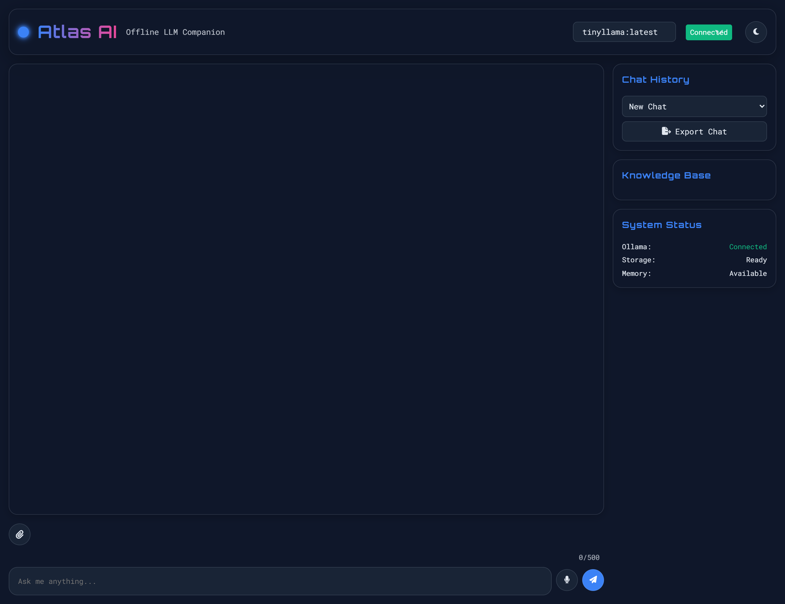
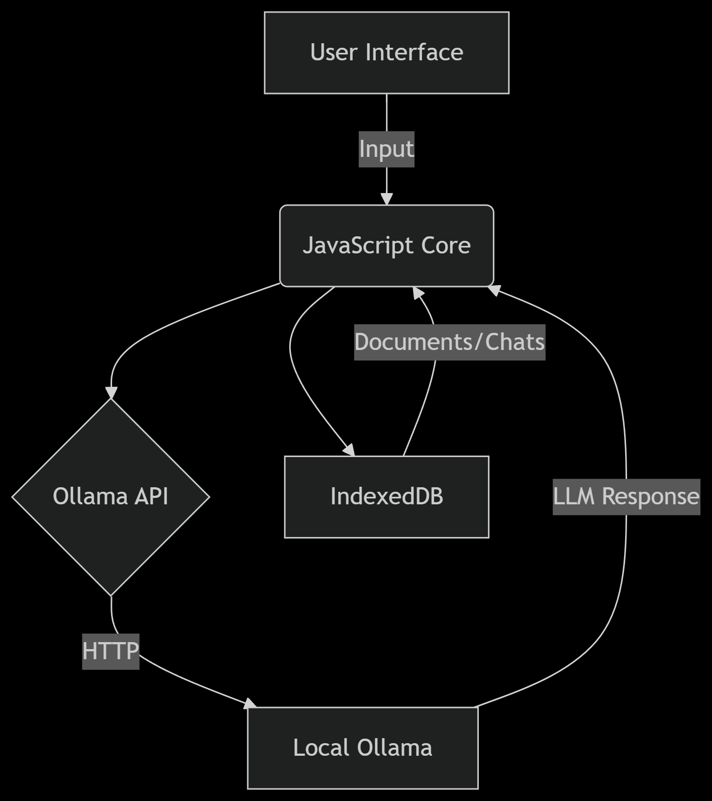
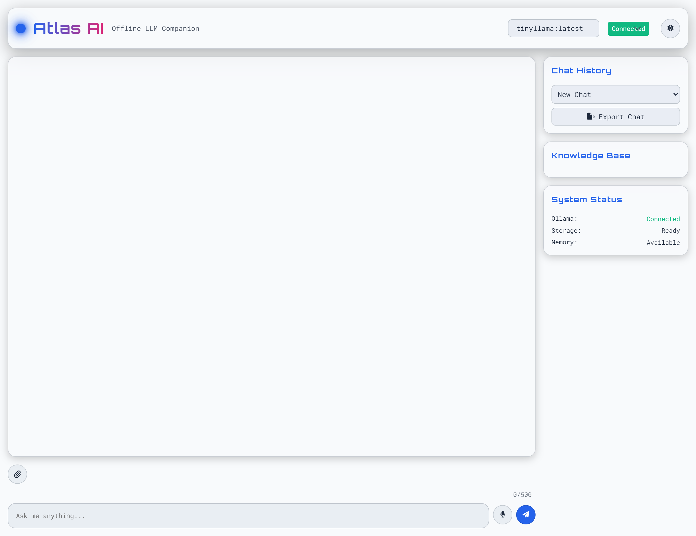
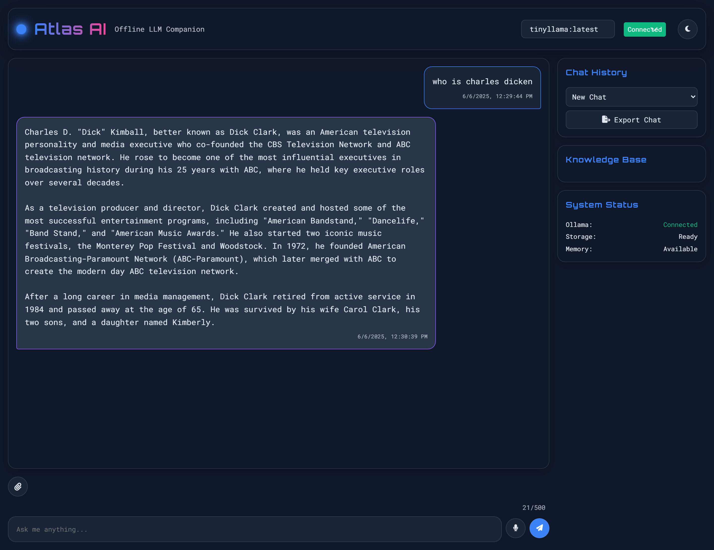
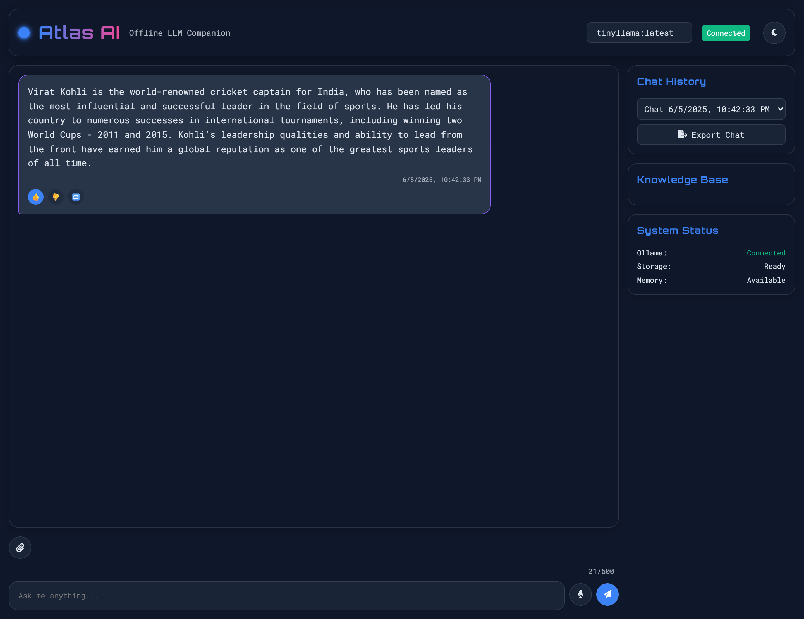
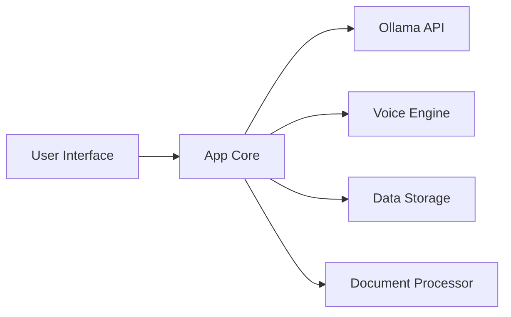

# Atlas AI - Offline LLM Companion

[](LICENSE)


A fully offline AI assistant with sci-fi interface, voice input, and document search powered by Ollama.


| INTERFACE | 
|-------------|
|  |

## ✨ Features

- **Offline AI Chat** - Local Ollama integration
- **Voice Input** - Web Speech API with visual feedback
- **Document Search** - PDF/TXT semantic search
- **Time-Travel Editing** - Edit previous messages
- **PWA Support** - Installable offline app
- **Themes** - Dark/light mode with auto-switch

## 🚀 Getting Started

### Prerequisites
1. Install [Ollama](https://ollama.ai/)
2. Pull a model:
```bash
ollama pull llama3
```

### Run Locally
```bash
# Start Ollama
ollama serve

# Serve the app (requires Python)
python -m http.server 8000
```
Then open `http://localhost:8000`

## 🧩 Tech Stack

**Frontend**  


**Libraries**  
[PDF.js](https://mozilla.github.io/pdf.js/) | [Prism.js](https://prismjs.com/)

**Storage**  
IndexedDB | localStorage

## 🏗️ Architecture


| System Diagram | 
|-------------|
<p align="left">

</p>


### Key Components
1. **UI Layer**: Glassmorphic interface with responsive design
2. **Ollama Bridge**: Handles model communication
3. **Voice Engine**: Speech-to-text conversion
4. **Document Processor**: PDF/text extraction
5. **Storage Module**: IndexedDB operations
6. **PWA Service Worker**: Offline caching

---

## 📂 Project Structure
```
atlas-ai-offline-llm-companion/
├── assets/           # Media files
├── scripts/          # JavaScript modules
├── styles/           # CSS files
├── index.html        # Main entry point
├── test.html         # Feature tests
├── manifest.json     # PWA configuration
├── service-worker.js # Offline caching
└── README.md         # Documentation
```

## 📸 Screenshots

| Light Mode | Dark Mode |
|------------|-----------|
|  |  |

| Voice Input | Document Search |
|-------------|-----------------|
|  |  |

---

## 🏛️ ARCHITECTURE.md

# Atlas AI Architecture

## System Overview
Atlas AI is a client-only application with these core components:



## Component Details

### 1. User Interface
- **Glassmorphic Design**: CSS-based sci-fi aesthetic
- **Responsive Layout**: Works on mobile/desktop
- **Dynamic Elements**:
  - Message bubbles with markdown support
  - Real-time streaming response UI
  - Animated voice input indicator

### 2. App Core (`app.js`)
- **Event Handling**: User interactions
- **State Management**: Chat sessions, model selection
- **Orchestration**: Coordinates between modules
- **Error Handling**: Unified error management

### 3. Ollama API Bridge (`ollama-api.js`)
```javascript
{
  generateResponse(model, prompt, onToken) {
    // Streaming implementation
  }
}
```
- Handles HTTP communication with local Ollama
- Supports both single-response and streaming
- Automatic model detection

### 4. Voice Engine (`voice.js`)
- Web Speech API integration
- Visual feedback with animated orb
- Auto-inserts transcriptions into input

### 5. Document Processor (`fileReader.js`)
- **PDF Parsing**: Client-side text extraction via PDF.js
- **Text Processing**: Chunking and semantic search
- **IndexedDB Integration**: Stores documents offline

### 6. Data Storage (`storage.js`)
- **Chat History**: Full conversation persistence
- **Document Cache**: Uploaded files storage
- **Key Operations**:
```javascript
createChat(), addMessage(), getDocuments()
```

### 7. PWA Layer
- **Service Worker**: `service-worker.js`
- **Caching Strategy**: Network-first with offline fallback
- **Install Prompt**: Standard PWA installation flow

## Data Flow
1. User submits query via text/voice
2. App checks document context
3. Query sent to Ollama via API bridge
4. Response streamed to UI in real-time
5. Full response saved to IndexedDB
6. UI updated with new message

## Key Design Decisions
1. **Offline-First Architecture**:
   - Service worker caches all assets
   - IndexedDB for persistent data
   - Fallback UI for network failures

2. **Vanilla JS Philosophy**:
   - Zero frameworks for maximum performance
   - Custom state management
   - Direct DOM manipulation

3. **Streaming Optimizations**:
   - Token-by-token UI updates
   - Auto-scroll management
   - Cancelable requests

4. **Security Model**:
   - All processing client-side
   - No external network requests
   - Strict CSP in production

---


## 📜 License
MIT © [Arman Shaikh R](LICENSE)
